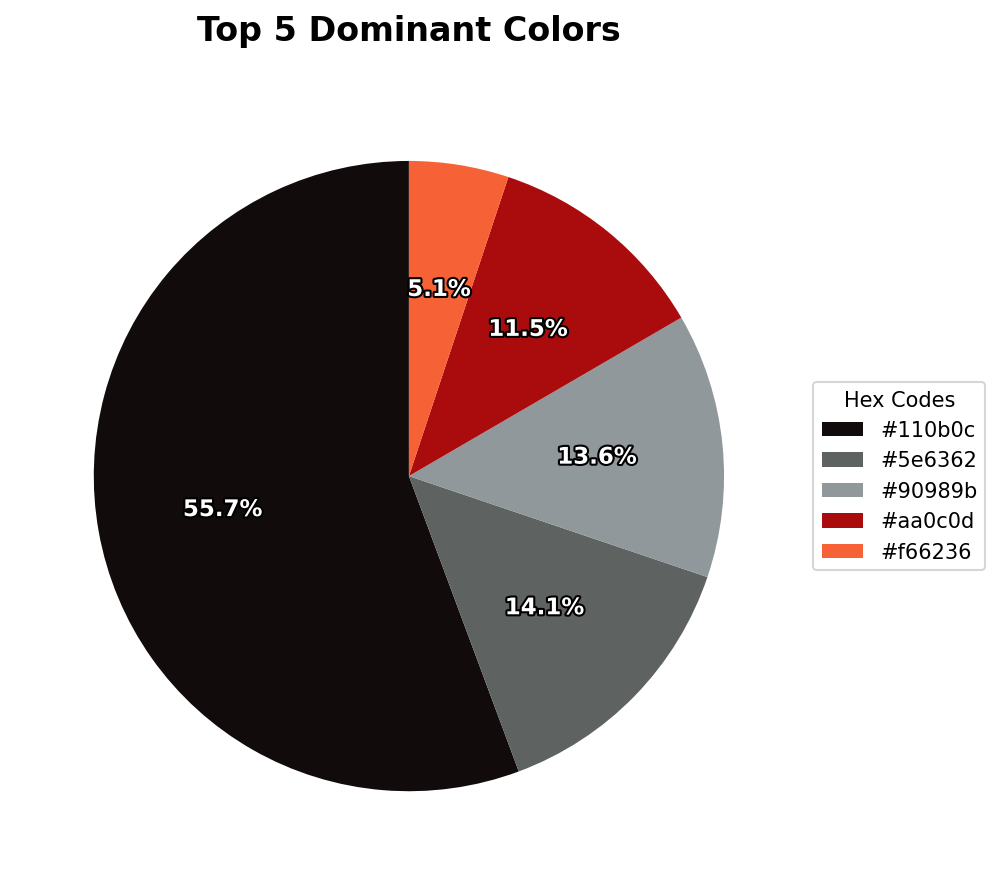
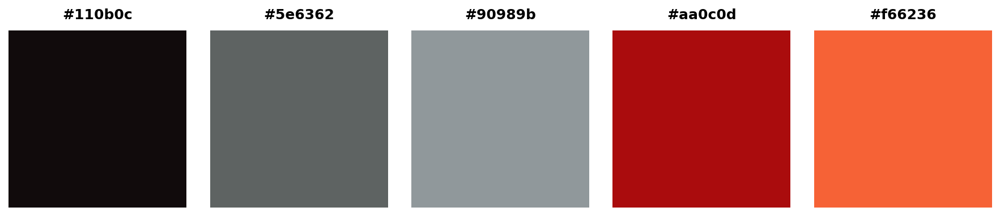

# K-Means Palette Extractor

## Overview
This repository hosts a **Computer Vision CLI tool** designed to analyze the color composition of images using **Unsupervised Machine Learning**.

By applying the **K-Means Clustering** algorithm to raw pixel data, the pipeline performs **Vector Quantization** to reduce the continuous color space of an image into a discrete set of dominant representative colors (centroids). This automation is designed for bulk image processing and palette generation.

**Key Technical Capabilities:**
* **Dimensionality Reduction:** Compressing millions of pixel values into a representative palette ($k$ clusters).
* **Batch Processing:** Automated pipeline (`main.py`) that ingests directories of images for bulk analysis.
* **Algorithmic Extraction:** Using statistical clustering rather than simple frequency counting to identify dominant themes.

---

## 1. Algorithmic Approach

The core engine (`color_engine.py`) relies on the **K-Means** algorithm, which minimizes the within-cluster sum of squares (Inertia).

The objective function is defined as:

$$J = \sum_{i=1}^{k} \sum_{x \in C_i} ||x - \mu_i||^2$$

Where:
* $k$ is the number of desired colors (clusters).
* $x$ is a pixel vector $(R, G, B)$.
* $\mu_i$ is the centroid of cluster $C_i$.

---

## 2. Automated Visual Analysis

The system automatically renders the statistical distribution of the clusters into visual assets.

| Dominant Palette | Color Swatches |
|:---:|:---:|
|  |  |
| *Figure 1: Proportional distribution of clusters.* | *Figure 2: Extracted centroids converted to hex swatches.* |

---

## 3. Installation & Usage

To reproduce this pipeline locally:

```bash
# 1. Clone the repository
git clone [https://github.com/Hexicon404/K-Means-Palette-Extractor.git](https://github.com/Hexicon404/K-Means-Palette-Extractor.git)

# 2. Install dependencies
pip install -r requirements.txt

# 3. Run the extraction pipeline
# Usage: python main.py --dir [IMAGE_FOLDER] --colors [NUMBER_OF_CLUSTERS]
python main.py --dir images --colors 5
```

## Tech Stack
* **Language:** Python 3.9+ (CLI Architecture)
* **Machine Learning:** Scikit-Learn (K-Means Clustering)
* **Image Processing:** OpenCV (`cv2`), Pillow (`PIL`), NumPy
* **Visualization:** Matplotlib (Automated chart generation)
* **Data Management:** Pandas (CSV Export)

## Limitations
* **Memory Constraints:** The engine aggregates pixels from all images into a single matrix for global clustering. Very large datasets may require batching to avoid RAM overflow.
* **Feature Loss:** To optimize performance, images are downsampled (default: 300px) before clustering. This filters out high-frequency noise but may miss micro-details.
* **Context Blindness:** As an unsupervised method based purely on pixel intensity, the algorithm does not distinguish between foreground and background subjects.

## License
MIT License

